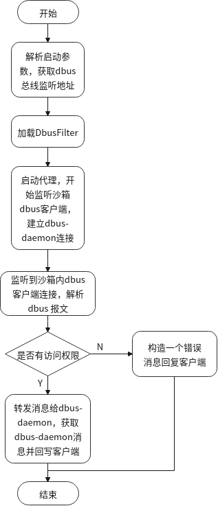

# 原理

先生成一个唯一的socket文件，挂载到沙箱/run/user/$UID/bus（session总线，system类似），dbus代理通过socket文件实现对沙箱内dbus总线消息进行监听，当监听到的dbus消息报文中的name/path/interface不满足用户设置的白名单规则时，dbus代理不会将此消息转发到dbus-daemon，并伪造一条符合dbus协议标准的错误socket报文来回复客户端，沙箱内客户端就无法通过dbus访问沙箱外资源，从而达到沙箱dbus权限管控的目的。伪造的错误报文如下：

```
"l\x03\x01\x01""B\x00\x00\x00\x03\x00\x00\x00g\x00\x00\x00\x04\x01s\x00(\x00\x00\x00org.freedesktop.DBus.Error.UnknownMethod\x00\x00\x00\x00\x00\x00\x00\x00\x06\x01s\x00\x06\x00\x00\x00:1.120\x00\x00\x05\x01u\x00\x02\x00\x00\x00\b\x01g\x00\x01s\x00\x00\x07\x01s\x00\x06\x00\x00\x00:1.103\x00\x00=\x00\x00\x00org.freedesktop.DBus.Error.AccessDenied, dbus msg hijack test\x00"
```

dbus客户端、代理、dbus-daemon的交互流程图如下：

<div align=center>
    box client <==> dbus-proxy <==> dbus-daemon
</div>

对于沙箱的应用程序来说，dbus-proxy是服务端，负责监听并转发应用程序的dbus消息给dbus-daemon，对于dbus-daemon来说，dbus-proxy是客户端，负责将监听到的沙箱应用程序的dbus消息转发给dbus-daemon，同时将dbus-daemon回复的dbus消息转发给客户端。

# 管控规则

判断客户端dbus消息报文中的name/path/interface与预先设定的管控白名单是否匹配。当前dbus管控规则支持*、+、？三种通配符，白名单当前支持2种方式配置：

1. 运行应用时配置，格式如下：

   `ll-cli run  --session --filter-name=com.deepin.linglong.AppManager --filter-path=/com/deepin/linglong/PackageManager --filter-interface=com.deepin.linglong.PackageManager  org.deepin.music`
2. 在~/.linglong/{appId}/app.yaml或应用的info.json中配置。

管控白名单格式如下：

```
{
    "dbuspermission": {
        "interface": [
            "org.freedesktop.portal.",
            "org.freedesktop.DBus",
            "com.deepin.linglong.PackageManager"
        ],
        "name": [
            "org.freedesktop.portal.",
            "org.freedesktop.DBus",
            "com.deepin.linglong.AppManager"
        ],
        "path": [
            "/org/freedesktop/portal/",
            "/",
            "/org/freedesktop/DBus",
            "/com/deepin/linglong/PackageManager"
        ]
    }
}
```

# DEMO实现

ll-dbus-proxy demo主要包含DbusProxy、DbusFilter、DbusMessageUtil三个模块，DbusFilter负责校验沙箱内dbus消息是否在用户配置的白名单允许范围内，DbusMessageUtil负责dbus socket报文的解析（也可以使用libdbus-1-dev解析），DbusProxy负责启动监听，同时建立和dbus-daemon连接。

处理流程图如下：

<div align=center>
	
</div>

# 运行

使用ll-box进入沙箱后，使用dbus-send模拟沙箱应用对沙箱外系统资源的访问，沙箱内客户端测试结果如下：

```
test@linghong:/$ ls
bin  dev  etc  home  lib  lib32  lib64  libx32  ll-host  opt  proc  run  runtime  sys  tmp  usr  var
test@linglong:/$ dbus-send --session --type=method_call --print-reply --dest=com.deepin.linglong.AppManager /com/deepin/linglong/PackageManager com.deepin.linglong.PackageManager.test string:"org.deepin.demo"
method return time=1645679724.674609 sender=:1.17266 -> destination=:1.17299 serial=8 reply_serial=2
   string "org.deepin.demo"
test@linghong:/$ dbus-send --session --type=method_call --print-reply --dest=com.scorpio.test /test/objects com.scorpio.test.value.book
Error org.freedesktop.DBus.Error.AccessDenied: org.freedesktop.DBus.Error.AccessDenied, dbus msg hijack test
test@linghong:/$
```

# 技术栈

| 技术方向 | 约束语言                     |
| :------: | ---------------------------- |
| 开发语言 | C++ 、C++11标准              |
|  依赖库  | Qt5Network、Qt5Core、libdbus |

# 说明

当前dbus-proxy demo由ll-service启动，后续待改造为ll-box启动。

# 代码覆盖率测试
add --coverage in CMakeLists.txt
```bash
set(CMAKE_C_FLAGS "${CMAKE_C_FLAGS} --coverage")
set(CMAKE_CXX_FLAGS "${CMAKE_CXX_FLAGS} --coverage")
```

use gcov、lcov to generate convert html report, make shure at the top level of the project
```bash
./code_coverage.sh
```

# QA

1. 沙箱内对session bus总线消息默认拦截处理，为保证玲珑适配应用dbus能正常工作，需要梳理所有适配应用对dbus总线的调用情况，工作量较大。
2. dbus动态授权机制由于沙箱不能冻结应用进程，dbus无权限访问情况下，弹窗向用户授权过程中会出现客户端dbus超时断开连接的情况（dbus底层默认超时时间为25s），此时dbus客户端在用户授权后仍会出现dbus访问报错的现象。
3. system总线的处理策略？(flatpak 默认不挂载，需要运行时添加相关的命令参数挂载)。

# 参考文档

Dbus 协议规范

[https://dbus.freedesktop.org/doc/dbus-specification.html#auth-command-negotiate-unix-fd]()

Flatpak沙箱参考

[https://docs.flatpak.org/en/latest/]()
